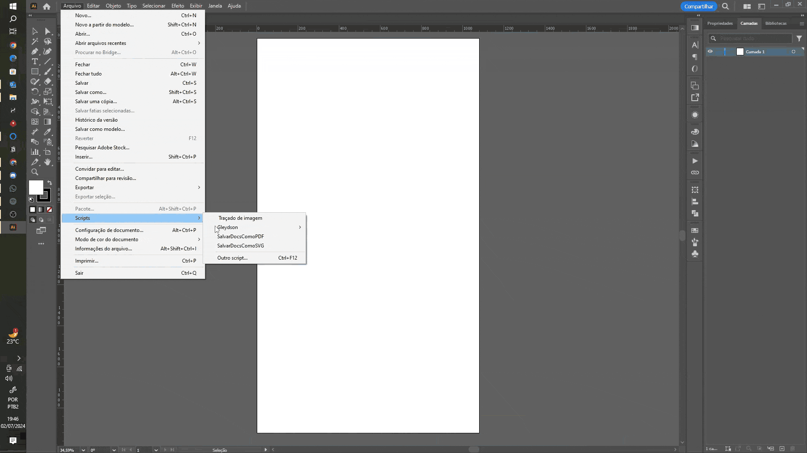

# Scripts for Illustrator
### Scripts para facilitar o seu dia-a-dia no Adobe Illustrator®

## Instalação
Passos para instalar e configurar o Illustrator:
1. Baixe o arquivo com o final dentro da pasta script (guide-layout.jsx)
2. Vá para a pasta %ProgramFiles%/Adobe/Adobe Illustrator xxxx/Presets/pt_BR/Scripts
3. Crie uma pasta com nome "User Scripts" ou outro nome que desejar
4. Cole o arquivo na pasta criada
5. Abra o Illustrator e crie um novo arquivo
6. Vá em Arquivo > Scripts > User Scripts

## Dicas
- Utilize as teclas <kbd>↑</kbd>, <kbd>↓</kbd> para adicionar ou remover valores;
- As teclas <kbd>Shift</kbd> + <kbd>↑</kbd> ou <kbd>Shift</kbd> + <kbd>↓</kbd> adicionam o diminuem 10 unidades ao valor vigente;
- As teclas <kbd>Ctrl</kbd> + <kbd>↑</kbd> ou <kbd>Ctrl</kbd> + <kbd>↓</kbd> adicionam o diminuem 0.1 unidades ao valor vigente;
- Infelizmente a parte de Scripts do Illustrator aceita décimos apenas utilizando o <kbd>.</kbd> não sendo possível utilizar a <kbd>,</kbd>;

  ## Guide Layout

### Licença
Este projeto está licenciado sob a GNU General Public License v3.0.
